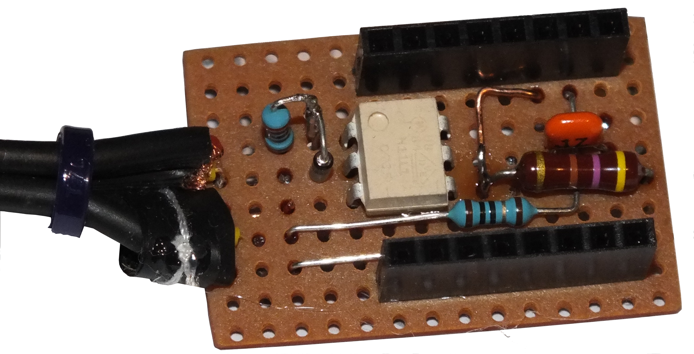
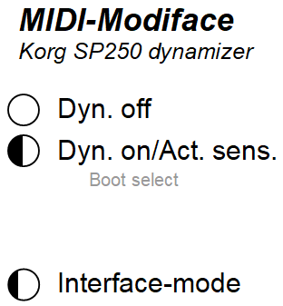
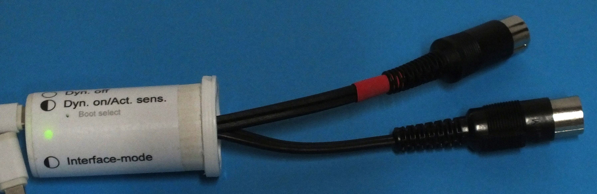

# Contents

* [MIDI Modiface](#MIDI-Modiface)
* [Hardware](#Hardware)
* [Software](#Software)
* [Operation](#Operation)

# **MIDI-Modiface**
"Modiface" is a combination of the words "Modifying MIDI Interface". In fact, the device has two different purposes/operation modes:
1) It acts as an ordinary USB-MIDI-interface as soon as it is connected to an appropriate USB-host, e.g. a computer.
2) If only connected to an USB-power-supply, it acts as a MIDI-loop-back device, filtering all _SYSTEM-EXCLUSIVE_-messages 
and changing the velocity of _NOTE-ON_-messages to maximum while certain MIDI-programs are chosen.

The later function is especially designed for the KORG SP-250 stage-piano, since this has 4 sound-programs (Harpsichord and three Church-Organs) that react dynamically to keyboard-action, but the original instruments don't. Therefore **Modiface**, when connected to the keyboards MIDI-out and -in, decouples the keyboard from the sound generator and maximizes the velocity when those programs are active.

It should be relatively easy to adapt this function to other keyboards.

# **Hardware**
The hardware is built around a Raspberry Pico. This board is equipped with an USB-C port that can be used as USB-MIDI-device-port. The onboard LED is used for visualizing the operation modes. In addition, UART1 is used as MIDI-interface. The circuit-diagram for adapting the serial interface to MIDI can be found [here](https://diyelectromusic.com/2022/08/29/3v3-midi-module-pcb).

The circuit is simple and can be built on a compact PCB:



My board was designed to fit underneath the pico. The whole stack then looks like this:


# **Software**
The software is written as VS-Code project. In addition to the standard libraries, TinyUSB is used in MIDI-device-mode.
It does not use a real-time-executive but works interrupt-driven with short interrupt-routines. 
The actual work (MIDI-filtering/data-forwarding in both directions as well as reacting to USB-events) is done in 
a work-loop in the main program. Passive waiting is used, i.e. the processor is sent to sleep when nothing is to do.
In fact the project is split up into two VS-Code subprojects in the following directory structure:

```
    |
    +--midimodiface
    |
    +--testmodiface
        |
        +--bsp
```
## midimodiface
This is the device software itself. It consists off the following code-files:

### midimodiface.c
This is the main-file. It initializes the software and contains the main-loop that calls the worker-procedures 
depending on the two different operation modes.

### midiprocessor.c
This module contains the worker-code. Most of it is responsible for filtering data in loop-back mode. 
Only one procedure implements the data forwarding in interface mode.
This file also contains the procedure that decides whether a program change-starts a dynamic program or not (`isDynamicProg()`).

### led.c
This utility module manages the onboard LED and its blinking patterns.

### uartmidi.c
This utility module implements handling of UART-MIDI-data receive and transmit.

### usbmidi.c
This utility module implements handling of USB-MIDI-data receive and transmit. Moreover, it manages USB-bus-events (e.g. mount, unmount ...).

### usb_descriptors.c
This module belongs to the tinyUSB-stack and is used for configuring it. Also _tusb_config.h_ is used for this purpose.

## testmodiface
This project contains code for testing the filter-logic in _midiprocessor.c_.
It does not utilize a testing framework but runs directly on the pico. Only the loopback logic is tested, since the forwarding logic mainly copies data between HW-dependent procedures. 
I used the USB-Port to debug the software (thanks to majbthrd, see [here](https://github.com/majbthrd/pico-debug)), so I could not use the USB-console for output. 
Therefore I simply placed two endless loops into the code that indicate either test-fail or test-pass (_testmodiface.c_ lines 134 and 136 respectively). By setting breakpoints there, 
the debugger immediately shows the test results. Tested is the output of the logic and the LED behaviour in reaction to a lengthy input sequence. The LED is also driven directly 
by the test so that it blinks while the test is running.
This program preferably is loaded onto the pico in "run in memory"-mode, since it does not make sense to flash it permanently.

### testmodiface.c
Contains the necessary stubs, the test-driver, the test-data and the test itself.

### midiprocessor.c
The module under test. (I linked that one as well as the corresponding header directly to the original source in the midimodiface-directory.)

All other header-files including the one in subdirectory _bsp_ are stubs that are needed to satisfy the dependencies of _midiprocessor.c_.

# **Operation**
There is not much to say about this, since the device does not have much to interact with.
In any case, the MIDI-DIN-Plugs have to be connected to a MIDI-keyboard, preferably to a Korg SP-250, but at least for operation as
MIDI-interface any keyboard should work.

## Loop-back mode
To operate **Modiface** in loop-back mode, simply connect its USB-socket to a USB-Power supply. It will not draw much current, so every standard supply is sufficient.
When entering loop-back mode, **Modiface** will send a _LOCAL-OFF_-Message to the keyboard in order to decouple the keyboard from the sound-generator. This is necessary to be able to manipulate MIDI-messages externally.
In addition **Modiface** cancels all _SYSTEM-EXCLUSIVE_-messages in this mode since receiving those messages while sending them might lead to unexpected results. Moreover, they make only sense when the keyboard is connected to a computer.
- In non-filtering mode, the LED indicates the presence of ACTIVE-SENSING commands and will blink accordingly. Since those messages are sent on a regular basis (every 270 ms or so) this results in a 50/50 blinking pattern. If other MIDI-messages are received, it will turn off.
- In filtering mode (i.e. after one of the MIDI-programs 12 (Harpsichord) or 21-23 (Church Organs) is called) the LED is switched on. In this mode **Modiface** changes velocity values in Range 1-127 of every _NOTE-ON_-message to 127.

## Interface mode
**Modiface** enters interface-mode as soon as it detects a working connection to an USB-host. In this mode it works just like ordinary MIDI-interfaces, forwarding all received MIDI-messages in both directions.
On entering this mode, **Modiface** will send a _LOCAL-ON_-Message to the keyboard in order to leave the effects of the loop-back-mode. No filtering is performed.
- The LED indicates interface-mode by flashing a 25%-off, 75%-on pattern with a duration  of one second.

## Short guide
My **Modiface** has a short guide glued to the case that explains the different LED-patterns in the different operation-modes:



The LED is located between the explanations of loop-back and interface modes. This is why there is an empty space between the pattern explanations of both modes.
(The `Boot select` label on this sticker has nothing to do with the operation of **Modiface** itself but denotes a hole in the case that is used to flash the pico-device.)
I used an empty tablet-tube as cheap housing for my **Modiface**. The whole device therefore looks like this:


